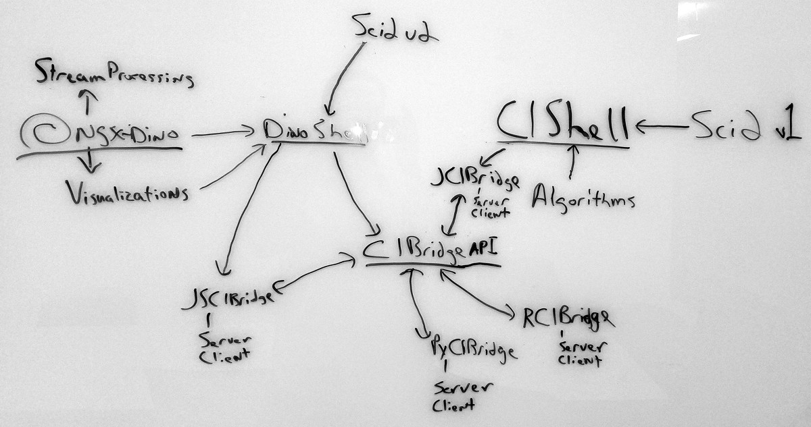

# CIBridge

## Work In Progress

This repo is a work in progress. Come back later.

## Vision

CIBridge will build the bridges that connect everyone at the lab (and beyond) together.
It will provide the infrastructure to join three realms: data scientists who use GUIs, data scientists who write scripts, and software developers who create hardened software.

## Goals

*   **CIBridge API** - Create an API which allows users to run algorithms, including
from CIShell, over a standard GraphQL API.
*   **Create Bridges** - Using the CIBridge API create bridges to and from CIShell, R, Python, and JavaScript.
*   **Update CIShell** - Clean up and modernize CIShell, Sci2, and its algorithms.

## Basic Interaction Diagram

## Epics
*   Revamp the CIShell build infrastructure
*   Remove old algorithms, updating existing good algorithms, and adding new algorithms
*   Divorce the algorithms from the UI (and Eclipse) completely
*   Create a GraphQL API (CIBridge) for using algorithms over the web/anywhere
*   Update the Sci2 UI to use algorithms over the CIBridge API
*   Create a test harnass to effectively test CIBridge and algorithms advertised by CIBridge
*   Document CIBridge
*   Release Sci2 v1.5 and CIBridge 1.0
*   Create Python, R, and JavaScript/TypeScript clients to the CIBridge API
*   Create Python, R, and JavaScript servers which advertise algorithms written in their respective languages via their own CIBridge API implementation
*   Create a completely new UI, DinoShell, in Angular
*   Create Sci2 2.0 with DinoShell 1.0, CIShell 2.0, and CIBridge 1.0.

## Links (In Process)

Essential links for this project.

*   Submit an Issue: 
*   [GitHub Repository](https://github.com/CIShell/cibridge)
*   [Project Board](https://app.zenhub.com/workspace/o/CIShell/cibridge)

## Timelines & Milestones

Rough timelines created at the start of the project outlining some of the hard(ish) deadlines, milestones, etc.

*   2018-05-15 - Interns' First Day
*   2018-08-07 - Interns' Last Day
